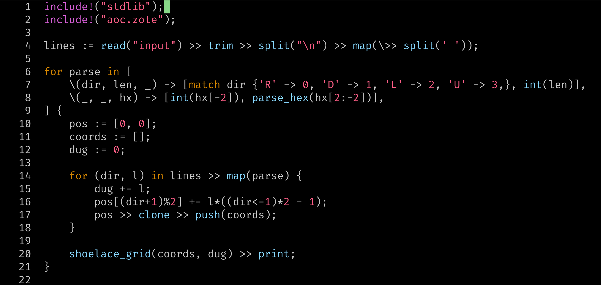

# A tree-sitter grammar for Zote

After 25 days of Advent of Code in [Zote](https://github.com/KvGeijer/zote) I started missing the syntax highlighting and syntax errors from other languages.

Here is an example of how it looks in Helix when using the theme `vim_dark_high_contrast`



## Installation

This repo contains the generated C code, in line with what is expected from [tree-sitter](https://tree-sitter.github.io/tree-sitter/). This can then be compiled and integrated with most modern editors.

The folder `queries` contains the queries for syntax highlighting, and should be used when integrating with your chosen editor.

### Using in Helix

Add this to your `languages.toml`
```
[[language]]
name = "zote"
auto-format = false
scope = "source.zote"
injection-regex = "zote"
file-types = ["zote"]
comment-token = "//"
indent = { tab-width = 4, unit = "    " }
roots = []

[[grammar]]
name = "zote"
source = {git = "https://github.com/KvGeijer/tree-sitter-zote", rev = "main"}
```

This will add `Zote` as a language, detect it automatically, and connect it with this tree-sitter. Then, to get syntax highlighting, add the queries from this repository to your helix runtime config.

```
cp -r tree-sitter-zote/queries ~/.config/helix/runtime/zote
```

Finally, fetch and build the grammar.

```
hx -g fetch
hx -g build
```
